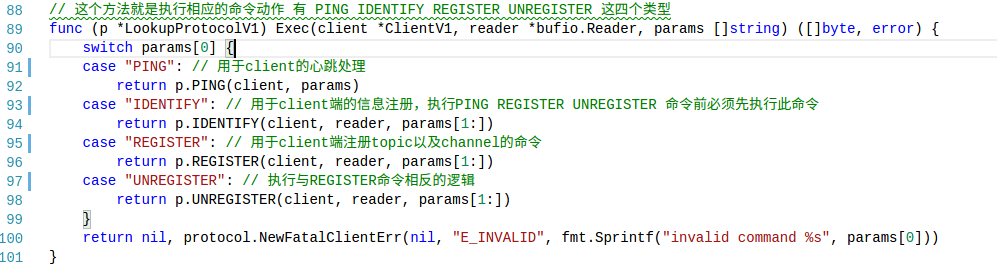
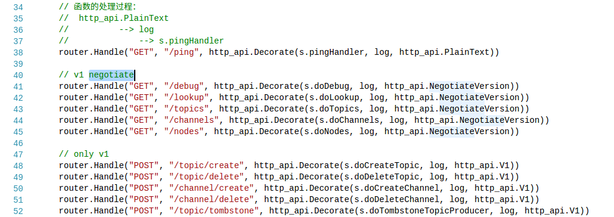

# nsqlookupd

### nsqlookupd介绍

+ nsqlookupd是守护进程负责管理拓扑信息。客户端通过查询 nsqlookupd来发现指定话题（topic）的生产者，并且 nsqd节点广播话题（topic）和通道（channel）信息。

+ 有两个接口：TCP 接口，nsqd用它来广播;HTTP 接口，客户端用它来发现和管理。

+ TCP接口说明：

  + TCP接口主要实现协议LookupProtocolV1，在loopup_protocol_v1.go中实现,实现下图的是个方法，跟nsqd进行交互（nsqd的认证、注册、反注册以及心跳的维护）。

    

    具体协议参考http://nsq.io/clients/tcp_protocol_spec.html

+ HTTP接口提供的服务如下：

  

  在nsqlookupd/http.go中实现上面的业务功能，https://github.com/feixiao/nsq-0.3.7/blob/master/nsqlookupd/http.go 中有详细的说明。 

  + GET /ping	监控端点，必须返回 OK
  + GET /debug   返回全部producer的信息
  + GET /lookup  获取指定topic下面的channel和生产者的对应关系
  + GET  /topics  获取全部的的topic信息
  + GET /channels  获取指定topic下面的channel信息
  + GET /nodes  获取生产者节点信息
  + POST /topic/create  根据传入的名字创建topic (key为{"topic", topicName, ""})，这时producer为空结构
  + POST /topic/delete  根据传入的名字删除topic (先删除channel再删除topic)
  + POST /channel/create  根据传入的名字创建channel（key 为{"channel", topicName, channelName}）
  + POST /channel/delete  根据传入的名字删除channel
  + POST /topic/tombstone 让指定topic下面的一个生产者失效

+ [详细的http协议介绍](http://nsq.io/components/nsqlookupd.html)

### 参考资料

+ [nsqlookupd介绍中文版](http://udn.yyuap.com/doc/wiki/project/nsq-guide/nsqlookupd.html)
+ [nsqlookupd介绍官方文档](http://nsq.io/components/nsqlookupd.html)