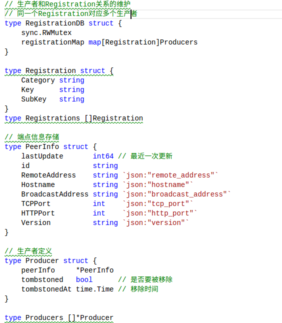

# nsqlookupd的数据管理

#### nsqlookupd提供TCP接口和HTTP接口

+ TCP接口用于nsqd进行注册连接，反馈自身的数据情况;

+ HTTP用于系统外部操作，以及nsqadmin查询那边状态信息等。

#### nsqlookupd的数据存储

+ nsqlookupd的元数据全部保存在内存中，使用RegistrationDB结构。

  

+ 通过上面的代码我们可以知道数据存储在map[Registration]Producers中，其中根据调整Registration中的Category、Key、Subkey来表示不同的类型，如：

  + Registration{"topic", topicName, ""}  表示Topic
  + Registration{"channel", topicName, channelName} 表示Channel
  + Registration{"client", "", ""} 表示Producer

  注：到目前位置我们没有没有将各种数据关联，关联关系需要nsqd自己上传，在[nsqlookupd/lookup_protocol_v1.go ](https://github.com/feixiao/nsq-0.3.7/blob/master/nsqlookupd/lookup_protocol_v1.go)中实现。

+ LookupProtocolV1的主要功能如下：

  

  + INDENTIFY
    + 上传nsqd的信息，填充PeerInfo，然后添加到RegistrationDB中（Registration{"client", "", ""}）。
  + REGISTER（nsqd创建topic或者channel的时候会发送这个命令）
    + 表示这个nsqd实例上面创建了某个topic或者channel，关联的nsqlookupd应该更新信息（Registration{"channel", topic, channel}的Producer部分会被赋值，完成关联关系）。
  + UNREGISTER（nsqd关闭topic或者channel的时候会发送这个命令）
    + 表示这个nsqd实例上面的某个topic或者channel被删除。