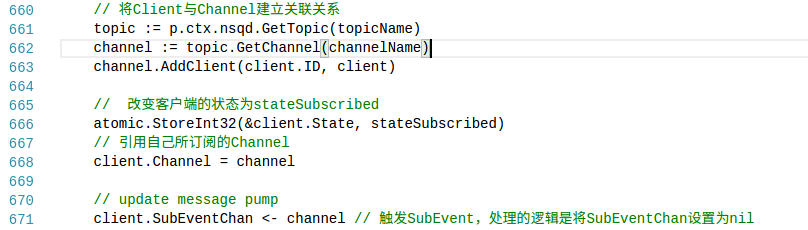
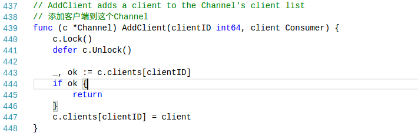
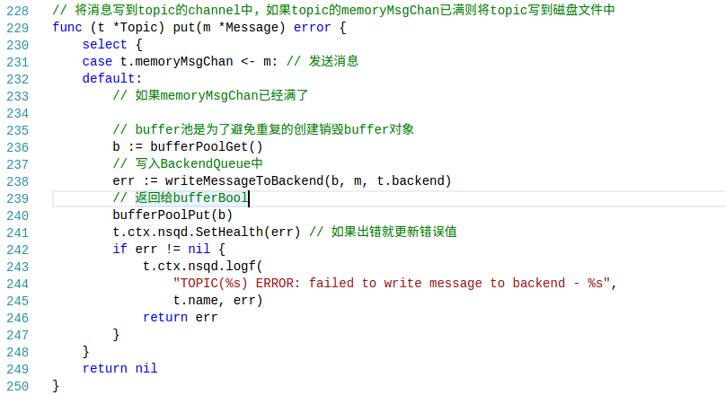
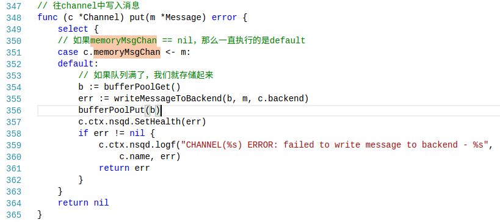
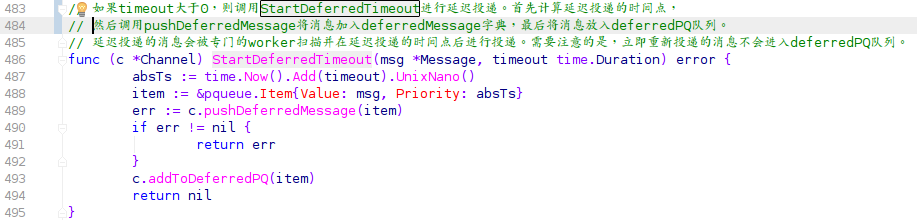
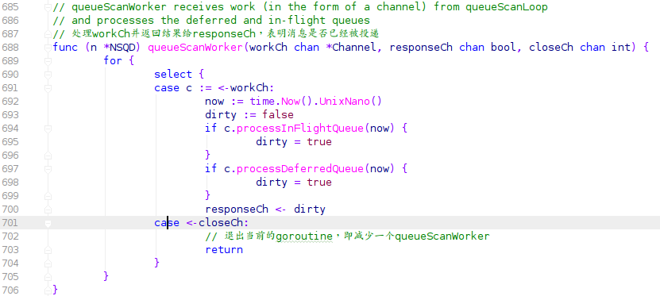

# nsqd的数据流

#### nsqd中关系的维护

+ 一个nsqd实例可以有多个Topic

  ```go
  topicMap map[string]*Topic
  ```

+ 一个Topic包含多个Channel

  ```go
  channelMap map[string]*Channel
  ```

+ 一个Channel下面含有多个Consumer

  ```go
  // state tracking
  clients   map[int64]Consumer // 维护该channel下面的Consumer
  ```

+ Consumer通过SUB命令来订阅某个Channel(之前需要使用IDENTIFY命令)

  **SUB命令主要如下**：

  

  **其中Channle.AddClient操作就是将client对象添加到clients结构中**

  

+ 完成订阅之后，查看生产者推送数据的逻辑，推送数据按协议来分有两种情况

  + HTTP方式

    + POST /pub		推送一个消息给某个指定的topic

    + POST /mpub         推送多个消息给某个指定的topic

  + TCP方式

      ```shell
      PUB <topic_name>\n
      [ 4-byte size in bytes ][ N-byte binary data ]

      MPUB <topic_name>\n
      [ 4-byte body size ]
      [ 4-byte num messages ]
      [ 4-byte message #1 size ][ N-byte binary data ]
            ... (repeated <num_messages> times)
      ```

      + 不管是pub还是mpub都是调用下面的函数

        messagePump中处理memoryMsgChan通道，关键代码如下：

      + 获取Topic下面的全部Channel

        ```go
        // 获取的到该Topic下面的全部Channel
        for _, c := range t.channelMap {
        	chans = append(chans, c) // 保存topic下面的全部channel，下面用于分发数据
        }
        ```

      + 获取需要发送的消息

        ```go
         // msg来自两个地方
         case msg = <-memoryMsgChan: // 什么都不做，只是把消息分发出去
         case buf = <-backendChan:
            msg, err = decodeMessage(buf)
            if err != nil {
            	t.ctx.nsqd.logf("ERROR: failed to decode message - %s", err)
            	continue
            }
        ```

      + 发送N份数据（msg被复制了多份然后发送给Channel）

        ```go
        // 将msg复制N份，发送到topic下的N个Channel中
          for i, channel := range chans {
          		chanMsg := msg
          		// copy the message because each channel
          		// needs a unique instance but...
          		// fastpath to avoid copy if its the first channel
          		// (the topic already created the first copy)
          		if i > 0 {
          			chanMsg = NewMessage(msg.ID, msg.Body)
          			chanMsg.Timestamp = msg.Timestamp
          			chanMsg.deferred = msg.deferred
          		}
          		if chanMsg.deferred != 0 {
                    	// 延迟发送的消息
          			channel.StartDeferredTimeout(chanMsg, chanMsg.deferred)
          			continue
          		}
            		// 立即发送的数据
          		err := channel.PutMessage(chanMsg)
          		if err != nil {
          			t.ctx.nsqd.logf(
          				"TOPIC(%s) ERROR: failed to put msg(%s) to channel(%s) - %s", t.name, msg.ID, channel.name, err)
          		}
          }
        ```

        注：其中chans会随着nsqd实例中的具体情况而变化，通过channelUpdateChan通道完成。

      + Channel发送数据：有两种行为，延迟发送消息和立即发送数据

        + 立即发送消息

          

          我们可以看到跟Topic的put方式一样的套路，Channel中同样存在函数messagePump处理memoryMsgChan通道

          + 获取需要发送的消息

            ```go
            select {
            	case msg = <-c.memoryMsgChan:
            	case buf = <-c.backend.ReadChan():
            		msg, err = decodeMessage(buf)
            		if err != nil {
            			c.ctx.nsqd.logf("ERROR: failed to decode message - %s", err)
            			continue
            		}
            	case <-c.exitChan:
            		goto exit
            }
            ```

          + 发送消息（将消息发送到clientMsgChan中）

            ```go
            msg.Attempts++ // 该变量用于保存投递尝试的次数。
            // 在消息投递前会将bufferedCount置为1，在投递后置为0。
            // 该变量在Depth函数中被调用。
            atomic.StoreInt32(&c.bufferedCount, 1)
            c.clientMsgChan <- msg 
            // 发送数据给clientMsgChan，在nsqd\protocol_v2.go的messagePump中处理
            atomic.StoreInt32(&c.bufferedCount, 0)
            ```

          + clientMsgChan的处理，关键代码如下：

            获取Channel对象

            ```go
            case subChannel = <-subEventChan:
            		// you can't SUB anymore
            		// 接收到客户端发送的SUB命令后，会向subEventChan中写入消息，
            		// subEventChan则被置为nil，所以一个客户端只能订阅一次Channel
            		subEventChan = nil
            ```

            获取消息发送

            ```go
            case msg, ok := <-clientMsgChan: 
            // 会有N个消费者共同监听channel.clientMsgChan,一条消息只能被一个消费者抢到
            		if !ok {
            			goto exit
            		}

            		if sampleRate > 0 && rand.Int31n(100) > sampleRate {
            			continue
            		}
            // 以消息的发送时间排序，将消息放在一个最小时间堆上，
            // 如果在规定时间内收到对该消息的确认回复(FIN messageId),
            // 说明消息以被消费者成功处理，会将该消息从堆中删除
            // 如果超过一定时间没有接受 FIN messageId，会从堆中取出该消息重新发送，
            // 所以nsq能确保一个消息至少被一个消费处理。
            		subChannel.StartInFlightTimeout(msg, client.ID, msgTimeout)
            		client.SendingMessage()
            		err = p.SendMessage(client, msg, &buf)
            		if err != nil {
            			goto exit
            		}
            		flushed = false
            ```

            客户端发送FIN，表明自己已经处理该消息，在FIN的函数中我们完成消息的确认。

            ```go
            // 管理发送出去但是对端没有确认收到的消息
            inFlightMessages map[MessageID]*Message 
            // 正在投递但还没确认投递成功的消息 type inFlightPqueue []*Message
            inFlightPQ       inFlightPqueue
            ```

        + 延迟发送消息

          

          延迟消息主要通过下面两个结构维护

          ```go
          deferredMessages map[MessageID]*pqueue.Item
          deferredPQ       pqueue.PriorityQueue 
          ```

          deferredPQ和inFlightPQ的处理都是在

          